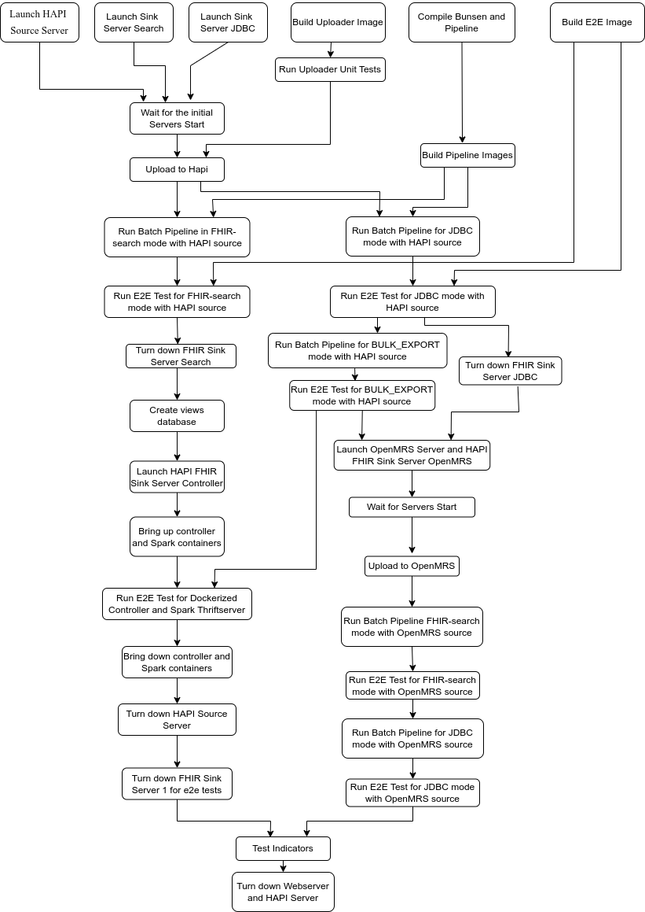

# Developer Tips

## Review process

Please read the [review process doc](review_process.md) before sending your
first PR.

## Generate the OpenMRS Docker image

The following steps are used to generate the openmrs docker image bundled with
modules required for this project

1.  Setup latest OpenMrs distro locally:

    ```
    mvn openmrs-sdk:setup -DserverId=openmrs-analytics
    ```

2.  Generate docker image setup using openmrs SDK, this step requires you to
    provide openmrs-distro.properties file path of your openmrs instance.

    ```
    mvn openmrs-sdk:build-distro -Ddistro=/{path}/openmrs-distro.properties`
    ```

    A folder named `docker` is generated which contains a Dockerfile and other
    setup files. Example of
    [docker file](https://github.com/jecihjoy/openmrs-docker-sdk/blob/master/web/Dockerfile)
    generated by openmrs-sdk.

3.  Build the docker image:

    ```
    cd openmrs-analytics/web docker build -t
    openmrs/openmrs-reference-application-distro:analytics .
    ```

4.  Push this image to docker hub
    `docker push openmrs/openmrs-reference-application-distro:analytics`

## Debezium development

When working on a feature in the Debezium based pipeline, you can replay old
binlog updates by setting the system properties `database.offsetStorage` and
`database.databaseHistory` to an old version of the history. In other words, you
can start from history/offset pair A, add some events in OpenMRS (e.g., add an
Observation) to create some updates in the binlog. Now if you keep a copy of
original version of A (before the changes) you can reuse it in future runs to
replay the new events with no more interactions with OpenMRS.

## Python development

This requires you to run to install some dev dependencies e.g. `black` and
`pylint` packages. It is a good idea to first create a Python `virtualenv`: (Run
these commands from the root of the repo)

_Note:_ we removed `isort` since now have `pylint` which can flag out of order
imports that the developer can check and fix.

```shell
virtualenv -p python3 venv
source ./venv/bin/activate
```

Then install the dev requirements:

```shell
pip install -r pip install -r requirements-dev.txt
```

## Running end-to-end tests on Cloud Build

When a Pull Request is submitted, it triggers a request to Google-owned project
running [Cloud Build](https://cloud.google.com/build) to run the build config
file defined in [`cloudbuild.yaml`](../cloudbuild.yaml). Any time a new commit
is submitted for the PR, a new Cloud Build run is triggered. You can see the
status of each run by scrolling to the bottom of the PR to see the status of
each build (pass/running/fail).

To view the logs from one of the builds, click on the `Details` link. This will
take you to a summary page for the build. On this page, you will see the status
of the build, with an associated Build ID. For example:

```text
Build 60a1260b-280a-4390-ad34-b1c1d7a4efb2 successful
```

To view the logs of this build, substitute the build id in place of `BUILD_ID`
in the URL below.

<https://storage.googleapis.com/cloud-build-gh-logs/log-BUILD_ID.txt>

Copy the URL into your browser, and you should see the logs from your build.

In the example above, the URL for the logs for that build would be:

<https://storage.googleapis.com/cloud-build-gh-logs/log-60a1260b-280a-4390-ad34-b1c1d7a4efb2.txt>

> **NOTE**: Clicking on the `View more details on Google Cloud Build` link will
> redirect you to a Google Cloud page which you do not have permissions to view.

## Running end-to-end tests locally

The CI pipeline can also be run locally, using the Cloud Build local builder. To
setup the local builder, follow the instructions
[here](https://cloud.google.com/build/docs/build-debug-locally); you will need
Docker, and the Google Cloud SDK to install the local builder. Once the local
builder is installed, do the following:

1. Stop any running `openmrs`, `openmrs-fhir-mysql`, and `sink-server`
   containers by running:

   ```bash
   docker stop sink-server openmrs openmrs-fhir-mysql
   ```

2. Run the e2e-test using the local builder:

   ```bash
   cloud-build-local  --dryrun=false .
   ```

## Parallelization of end-to-end tests

The end-to-end tests have been ordered based on their dependencies of the
previous steps, which makes certain steps to be run concurrently. The order of
the steps executed is shown in the below picture.



The flowchart has been developed using the https://app.diagrams.net/ tool and
the editable version of it is available at this
[location](./cloudbuild_flowChart.drawio.xml)

## Regenerate JAR File

Parquet tools library is used to inspect parquet files. The jar file has been
included in the project under `/e2e-tests/parquet-tools-1.11.1.jar`

To regenerate this jar file:

1.  Clone [parquet-mr](https://github.com/apache/parquet-mr)
2.  Checkout last released version `git checkout apache-parquet-1.11.1`
3.  [Install](https://github.com/apache/parquet-mr#install-thrift) thrift
    compiler v0.12.0
4.  To build the jar file run
    `mvn -pl parquet-tools -am clean install -Plocal -DskipTests` You should be
    able to see `parquet-tools-1.11.1.jar` inside parquet-tools module.
5.  Command usage for parquet tools
    `java -jar ./parquet-tools-<VERSION>.jar <command> my_parquet_file`

    NOTE: Parquet tools will be replaced with parquet cli in the next release
    `apache-parquet-1.12.0`

## Error Prone and NullAway

We use [Error Prone](https://errorprone.info/index) and
[NullAway](https://github.com/uber/NullAway) to catch common issues at build
time, in particular `NullPointerException`s. These are enabled in
[pom.xml](../pipelines/pom.xml) according to
[installation instructions](https://errorprone.info/docs/installation#maven). An
unfortunate side effect of this is that we need manually add all annotation
processors that we care about as discussed
[here](https://errorprone.info/docs/installation#using-error-prone-together-with-other-annotation-processors).

Currently, these errors only appear as WARNING and are not blockers but please
take a look at the new ones caused by your changes and fix them as we are trying
to address all of these, gradually. You can enable Error Prone in your IDE too,
see [here](https://errorprone.info/docs/installation#intellij-idea).
