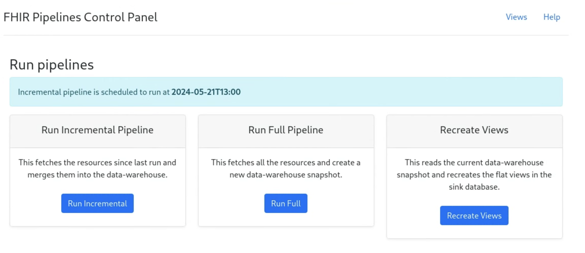

# Additional topics

## Authentication

Any openIDConnect provider can be used to supply oAuth credentials.

The required set of parameters are:

- oidConnectUrl
- clientId
- clientSecret
- oAuthUsername
- oAuthPassword

You can add oAuth authentication to the pipeline by providing the required set
of parameters via the command line or in the
`/pipelines/controller/config/application.yaml` file.

<!-- prettier-ignore-start -->
=== "Cmd line"
    ```java
    $ java -cp ./pipelines/batch/target/batch-bundled-0.1.0-SNAPSHOT.jar org.openmrs.analytics.FhirEtl \
        --fhirServerUrl=[FHIR_SERVER_URL] --outputParquetPath=[PATH] \
        --resourceList=Patient,Encounter,Observation --batchSize=200 \
        --clientId=[CLIENT_ID] --clientSecret=[CLIENT_SECRET] \
        --OAuthUsername=[USERNAME] --OAuthPassword=[PASSSWORD] \
        --oidConnectUrl= [OPENID_CONNECT_URL] \
    ```
=== "application.yaml"
    ```
    fhirdata:
    .....
        # The following client credentials should be set if the FHIR server accepts
        # OAuth access tokens. Note the client credentials, e.g., the secret, are
        # sensitive, and it is probably a better practice to set these through
        # command-line arguments.
        fhirServerOAuthTokenEndpoint: "https://path_to_endpoint_for_token"
        fhirServerOAuthClientId: "THE_CLIENT_ID"
        fhirServerOAuthClientSecret: "THE_CLIENT_SECRET"
    ```
<!-- prettier-ignore-end -->

## Config properties

The main configuration for the FHIR Data Pipes Pipeline and Controller is the
`/pipelines/controller/config/application.yaml` file which is well documented.

When using the provided docker images, this will be found in
`/docker/config.application.yaml`

## Parquet on FHIR schema

Apache Parquet is a horizontally scalable columnar format that is optimized for
performance.

FHIR Data Pipes transforms FHIR resources to _"near lossless"_ 'Parquet on FHIR'
representation based on the
["Simplified SQL Projection of FHIR Resources"](https://github.com/google/fhir-data-pipes/blob/master/doc/schema.md)
( _'SQL-on-FHIR-v1'_) schema

- The conversion is done using a forked version of
  [Bunsen library](https://github.com/google/fhir-data-pipes/tree/master/bunsen)
  to transform from FHIR (_current support for STU3, R4_) to the SQL-on-FHIR-v1
  schema

- The conversion is done by going from StructureDefinition --> AvroConverter -->
  Parquet

- Configurable support for FHIR versions, profiles and extensions is provided

## Monitoring pipelines

The pipelines controller exposes management end-points that can help with
monitoring the health of pipelines.

- The application has been integrated with the Spring Boot Actuator of Spring
  and has exposed Rest API end points for monitoring, health checks, metrics
  etc.
- The end points can be customised in the configuration file.
- It can easily be integrated with tools like Prometheus for monitoring metrics.

**Via the Web Control Panel** The Web Control panel provides a quick glimpse
about the latest state of the application including:

- Controls for triggering pipeline run on-demand
- A readable view of the application configuration
- Location and time of the latest snapshot created by the pipeline run
- Metrics of the most recent pipeline
- Error logs of the last pipeline if any

These are found in the `application.yaml` config file in the `management:`
section.

[See Config properties](#config-properties)

## Web Control Panel

The web control panel is a basic spring application provided to make interacting
with the pipeline controller easier.

_It **is not** designed to be a full production ready “web admin” panel_.

The web control panel has the following features:

- Initiate full and incremental pipeline runs
- Monitor errors when running pipelines
- Recreate view tables
- View configuration settings
- Access sample jupyter notebooks and ViewDefinition editor



## Controller CLI

This is a simple command-line interface (CLI) tool that interacts with the pipeline controller. It has most of the functionality available in the pipeline Web Control Panel enabling one to run the pipelines, view configuration settings, manage the data warehouse snaphots and other pipeline operations.

The CLI tool is packaged using setup tools and exposes the application via the `controller` utility command.

You can get the list of available commands by running with the help flags `-h` or`--help`. See sample output below.

```sh
usage: controller [-h] url {config,next,status,run,tables,logs,dwh} ...

The CLI tool for fhir-data-pipes

positional arguments:
  url                   url of the pipeline controller's REST API
  {config,next,status,run,tables,logs,dwh}
                        dwh, next, status, run, config, logs, tables are the available commands.
    config              show config values
    next                show the next scheduled run
    status              show the status of the pipeline
    run                 run the pipeline
    tables              create resource tables
    logs                show logs
    dwh                 show a list of dwh snapshots

optional arguments:
  -h, --help            show this help message and exit
```
Show config values

```sh
controller <url> config
```
Show specific config value

```sh
controller <url> config --config-name <config key>
```
Show the next scheduled run

```sh
controller <url> next
```
Show the status of the pipeline

```sh
controller <url> status
```
Run the pipeline

```sh
controller <url> run --mode <run mode>
```

**Note:** To run a pipeline you must supply a run mode using the `-m` or
`--mode` flag. The value of mode can be either of `full`, `incremental` or
`views`.
Create resource tables

```sh
controller <url> tables
```
Download error logs

```sh
controller <url> logs --download
```

You can pass an optional file name for the downloaded file. The default is `error.log`.

```sh
controller <url> logs --download --filename <filename>
```
Show a list of dwh snapshots

```sh
controller <url> dwh
```

Delete a specific snapshot

```sh
controller <url> dwh delete --snapshot-id <snapshot id>
```

**Note:** You can get the snapshot id by running the `controller <url> dwh`
first. A valid snapshot-id is the full id as shown in the list e.g.
`dwh/controller_DEV_DWH_TIMESTAMP_2025_08_14T17_47_15_357080Z`
