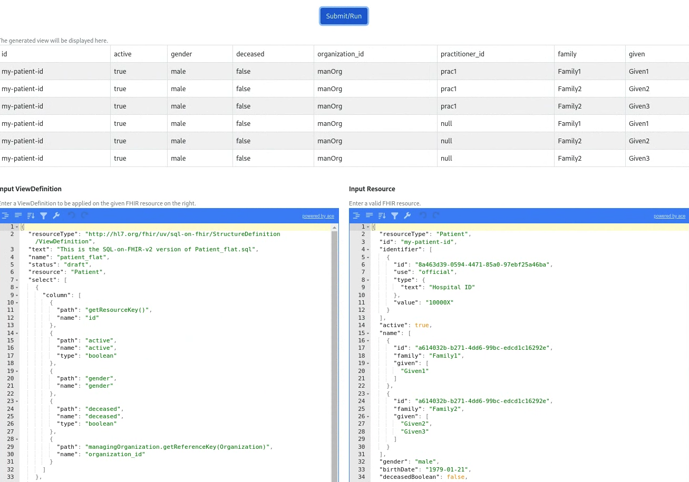

# OHS Analytics Concepts

The key concepts that underpin the OHS Analytics components are:

1. **Transform:** Easy to deploy ETL pipelines that transform data into an sql queryable Parquet formats
2. **Flexible and scalable deployment approaches**: Can be deployed on a single machine or multi-worker distributed environments
3. **Flatten:** Approaches to flattening FHIR resources to make it easier to query data

## FHIR Data Pipes Pipelines
FHIR Data Pipes is built on technology **designed for ease of scalability** and has multiple deployment options from _local, on-prem to cloud_.


FHIR Data Pipes is made up of the **ETL Pipeline** and **Controller** modules that work together to provide continuous transformation of FHIR data to Apache Parquet files for data analysis or another FHIR server for data integration. 

Pipelines is built using [Apache Beam](https://beam.apache.org/) and can run on a single machine or cluster.

### Extraction

FHIR Data Pipes is designed to work with FHIR source data in various forms: 

* Valid FHIR Server API (e.g. HAPI FHIR)
* FHIR facade implementations (e.g. OpenMRSv3)
* Bulk Export API data
* ndjson representation

### Transformation

FHIR Resources are transformed into a "Parquet on FHIR" format:

* Uses a forked version of [Bunsen library](https://github.com/google/fhir-data-pipes/tree/master/bunsen) to transform from FHIR (_current support for STU3, R4_) to the SQL-on-FHIR-v1 schema. 
* Configurable support for FHIR profiles and extensions
* (Optional) In-pipeline 'flattening' of FHIR data using [ViewDefinition](https://build.fhir.org/ig/FHIR/sql-on-fhir-v2/StructureDefinition-ViewDefinition.html) resources - [read more](#viewdefinition-resource) 

### Loading

FHIR Data Pipes supports different SQL Data Warehouse options depending on the needs of the project. These include:

* Loading Parquet into an OLAP data warehouse such as SparkSQL (which can be deployed on a single machine or as a distributed query engine) or DuckDB (single machine in-process)
* Traditional Relational data warehouse such as PostgreSQL (when using the FHIR ViewDefinitions resources to generate materialized views)

## Pipelines Controller
A user-interface wrapper for the FHIR Data Pipes Pipelines, integrating "full", "incremental", and "merger" pipelines together. 

* The Pipelines Controller is built on top of pipelines and shares many of the same settings
* Using the controller module you can schedule periodic incremental updates or use a [web control panel](link_to_section_in_adv_guide) to start the pipeline manually

## Flexible and scalable deployment approaches

There are a number of different deployment approaches - see table below. 

Choosing the right approach, comes down to evaluation of a number of factors including the specific use case, requirements of the project, future scalability needs and capabilities of the team. 

| Scenario | Approach | Considerations |
| -------- | ----------| -------------- |
|  Simple relational database to power dashboards or reporting | Custom schema defined as ViewDefinition Resources - [see tutorial](tutorial_lossy_example/) | By design this will provide a constrained set of variables in the views |
| Need for a horizontally scalable architecture | Parquet based DWH and distributed query engine (e.g. SparkSQL) - [see tutorial](tutorial_add_dashboard/) | Will need to manage both distributed storage (Parquet files) and a distributed query engine |
| Parquet as DWH with a non-distributed OLAP database engine | Parquet based DWH with non-distributed query engine set-up (e.g. SparkSQL or DuckDB) | Scalability and performance (e.g. SparkSQL >> DuckDB) |
| Exploratory data science or ML use cases | Use the generated Parquet files which as _"near lossless"_ for enhanced data science workflows | Can either use the Parquet or custom schema to power dashboards or reports |
| Push FHIR data to a central FHIR Data Store for a Shared Health Record or single repository for analytics workloads | Use the Pipelines Controller to push from a FHIR source to a FHIR sink | Management of the intermediate Parquet files created as part of the pipelines | 

## Pre-defined views for flattening FHIR data
The heavily nested nature of FHIR resources requires complex SQL queries that can make it difficult to work with for analytics use cases. A common approach to address this is to flatten the data into a set of views (virtual or materialized) which can then be queried using simpler SQL statements. 

FHIR Data Pipes provides two approaches for flattening the FHIR Resources into virtual or materialized views

1.  SQL queries to generate virtual views (outside the pipeline)
2.  FHIR ViewDefinition resources to generated materialized views (within the pipeline)

For both of these approaches, a set of **"predefined views”** for common resources are provided. These can be modified or extended.

The currently supported list (as at 1st June, 2024), which can be found in the `docker/config/views' directory are:

```
Condition, DiagnosticReport, Encounter, Immunization, Location, Medicationrequest, Observation, Organization, Patient, Practitioner, PractitionerRole, Procedure
```

### SQL virtual views
These are samples of more complex SQL-on-FHIR queries for defining flat views for common FHIR Resources. These virtual views are applied outside of the pipelines in the downstream SQL query engine. 

The queries, which have .sql suffix can be found here: /docker/config/views (e.g Patient_flat.sql)

An example of a flat view for the Observation Resource is below

```sql
CREATE OR REPLACE VIEW flat_observation AS
SELECT O.id AS obs_id, O.subject.PatientId AS patient_id,
        OCC.`system` AS code_sys, OCC.code,
        O.value.quantity.value AS val_quantity,
        OVCC.code AS val_code, OVCC.`system` AS val_sys,
        O.effective.dateTime AS obs_date
      FROM Observation AS O LATERAL VIEW OUTER explode(code.coding) AS OCC
        LATERAL VIEW OUTER explode(O.value.codeableConcept.coding) AS OVCC
```

### ViewDefinition resource
The [SQL-on-FHIR-v2 specification](https://build.fhir.org/ig/FHIR/sql-on-fhir-v2/) defines a standards based pattern for defining Views as FHIRPath expressions in a logical structure to specify the column names and values (as unnested items).

A system (pipeline or library) that implements the “View Layer” of the specification provides a View Runner that is able to process these FHIR ViewDefinition Resources over the “Data Layer” (lossless representation of the FHIR data). The output of this are a set of portable, tabular views that can be consumed by the “Analytics Layer” which is any number of tools that can be used to work with the resulting tabular data.
 
FHIR Data Pipes is a reference implementation of the SQL-on-FHIR-v2 specification:

*   The "View Runner" is by default part of the ETL Pipelines and uses the transformed Parquet files as the “Data Layer”. _This can be extracted to be a stand-alone component if required_

*   When enabled as part of the Pipeline configuration, it will apply the ViewDefinition Resources from the /config/views folder and materialize the resulting tables to the PostgresSQL database.

*   A set of pre-defined ViewDefinitions for common FHIR Resources is provided as part of the default package. These can be adapted, replaced and extended

*   The FHIR Data Pipes provides a simple ViewDefinition Editor which can be used to explore FHIR ViewDefinitions and apply these to individual FHIR Resources

Once the FHIR data has been transformed via the ETL Pipelines, the resulting schema is available for querying using a JDBC interface. 

### ViewDefinition editor
The ViewDefinition editor provides a way to quickly evaluate ViewDefinition resources against sample FHIR data. You access it as part of the Web Control Panel, selecting the "Views" navigation item in the top right corner.

Using the ViewDefinition editor you can:

* Provide an input ViewDefinition (left)
* Apply it to a sample input FHIR Resource (right pane)
* View the results in the generated table (top)


