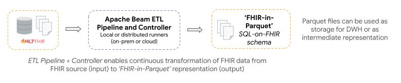

# OHS Analytics Concepts

The key concepts that underpin the OHS Analytics components are:

1. **ETL Pipelines:** ETL Pipelines and Controller can be configured to
   continuously transform FHIR data into an analytics friendly FHIR-in-Parquet
   format.
2. **Deployment approaches**: The pipelines are designed to accommodate various
   deployment approaches in terms of scalability; from a single machine to a
   distributed cluster environments.
3. **Query simplification approaches:** Once the data is transformed into an
   analytics-friendly format, it should be queried. Multiple approaches are
   provided and/or showcased to flatten FHIR schema to make developing analytics
   solutions easier.

## FHIR Data Pipes

FHIR Data Pipes is built on [Apache Beam](https://beam.apache.org/) SDK **for
ease of scalability** and has multiple deployment options from _local, to
on-prem clusters to public clouds_.

FHIR Data Pipes is made up of the **ETL Pipelines** and **Controller** modules *
*that are designed to work together** to provide continuous transformation of
FHIR data to Apache Parquet files (for data analysis) or another FHIR server (
for data integration).



## ETL Pipelines

Java binaries to **Extract**, **Transform** and **Load** FHIR data from a FHIR
source to Parquet format.

### Extraction

FHIR Data Pipes is designed to fetch FHIR source data in various forms and APIs:

* [FHIR Search API](https://www.hl7.org/fhir/search.html): This should work with
  most FHIR
  servers, including those using FHIR data model like HAPI FHIR or FHIR facades
  like OpenMRS.
* Direct database access: This is mostly a more efficient approach that works
  with HAPI FHIR only.
* Bulk Export API: This will gradually become our main fetch API as more FHIR
  servers implement
  the [Bulk Export API](https://build.fhir.org/ig/HL7/bulk-data/export.html).
* Files in json and ndjson formats.

### Transformation

FHIR Resources are transformed into a "Parquet on FHIR" format:

* Uses a forked version
  of [Bunsen library](https://github.com/google/fhir-data-pipes/tree/master/bunsen) (_
  currently supports STU3 and R4 versions of FHIR).
* Configurable support for FHIR profiles and extensions
* (Optional) In-pipeline 'flattening' of FHIR data
  using [ViewDefinition](https://build.fhir.org/ig/FHIR/sql-on-fhir-v2/StructureDefinition-ViewDefinition.html)
  resources - [read more](#viewdefinition-resource)

### Loading

FHIR Data Pipes supports different SQL Data Warehouse options depending on the
needs of the project. These include:

* Loading Parquet files into an OLAP query engine such as SparkSQL (which can be
  deployed on a single machine or a distributed cluster) or DuckDB (single
  machine in-process) or many other tools that understand Parquet.
* Traditional relational databases such as PostgreSQL (when using
  FHIR [ViewDefinition](https://build.fhir.org/ig/FHIR/sql-on-fhir-v2/StructureDefinition-ViewDefinition.html)
  resources to generate materialized views)

## Pipeline Controller Module

A user-interface wrapper for the FHIR Data Pipes Pipelines, integrating "
full", "incremental", and "merger" pipelines together.

* The Pipelines Controller is built on top of pipelines and shares many of the
  same settings
* Using the controller module you can schedule periodic incremental updates or
  use a [web control panel](link_to_section_in_adv_guide) to start the pipeline
  manually

## Deployment approaches

There are a number of different deployment approaches - see table below.

Choosing the right approach, comes down to a number of factors including the
specific use-case, infrastructure constraints of the project, future scalability
requirements, and expertise of the team.

| Scenario                                                                         | Approach                                                                                                 | Considerations                                                                            |
|----------------------------------------------------------------------------------|----------------------------------------------------------------------------------------------------------|-------------------------------------------------------------------------------------------|
| Simple relational database to power dashboards or reporting                      | Custom schema defined as ViewDefinition Resources - [see tutorial](tutorial_lossy_example/)              | By design, this will provide a subset of FHIR data in flat tables                         |
| Horizontally scalable query architecture with lossless FHIR data                 | Parquet based DWH and distributed query engine (e.g. SparkSQL) - [see tutorial](tutorial_add_dashboard/) | This requires a distributed file system for Parquet files and a distributed query engine. |
| Lossless FHIR DWH with a single process query engine                             | Parquet based DWH with non-distributed query engine set-up (e.g. single-node Spark or DuckDB)            | Scalability and performance (e.g. SparkSQL >> DuckDB)                                     |
| Exploratory data science or ML use cases                                         | Use the generated Parquet files which as _"near lossless"_ for enhanced data science workflows           | Can either use the Parquet or custom schema to power dashboards or reports                |
| Push FHIR data to a central FHIR-store (e.g., for a Shared Health Record system) | Use the Pipelines Controller to push from a FHIR source to a FHIR sink                                   | Management of the intermediate Parquet files created as part of the pipelines             | 

## Query simplification approaches with pre-defined views

The heavily nested nature of FHIR resources requires complex SQL queries that
can make it difficult to work with for analytics use cases. A common approach to
address this is to flatten the data into a set of views (virtual or
materialized) which can then be queried using simpler SQL statements.

FHIR Data Pipes provides two approaches for flattening the FHIR resources into
virtual or materialized views:

1. SQL queries to generate virtual views (outside the pipeline)
2.
FHIR [ViewDefinition](https://build.fhir.org/ig/FHIR/sql-on-fhir-v2/StructureDefinition-ViewDefinition.html)
resources to generate materialized views (within the pipeline)

For both of these approaches, a set of [**"predefined views”
**](https://github.com/google/fhir-data-pipes/tree/master/docker/config/views)
for common resources are provided. These can be modified or extended.

The currently supported list (as of June, 2024) are:

```
Condition
DiagnosticReport
Encounter
Immunization
Location
Medicationrequest
Observation
Organization
Patient
Practitioner
PractitionerRole
Procedure
```

### SQL virtual views

These are samples of more complex SQL-on-FHIR queries for defining flat views
for common FHIR resources. These virtual views are applied outside of the
pipelines in the downstream SQL query engine.

The queries, which have `.sql` suffix, can be found
in [/docker/config/views](https://github.com/google/fhir-data-pipes/tree/master/docker/config/views)
directory (e.g `Patient_flat.sql`).

An example of a flat view for the Observation resource is below:

```sql
CREATE OR REPLACE VIEW flat_observation AS
SELECT O.id AS obs_id, O.subject.PatientId AS patient_id,
        OCC.`system` AS code_sys, OCC.code,
        O.value.quantity.value AS val_quantity,
        OVCC.code AS val_code, OVCC.`system` AS val_sys,
        O.effective.dateTime AS obs_date
      FROM Observation AS O LATERAL VIEW OUTER explode(code.coding) AS OCC
        LATERAL VIEW OUTER explode(O.value.codeableConcept.coding) AS OVCC
```

### ViewDefinition resource

The [SQL-on-FHIR-v2 specification](https://build.fhir.org/ig/FHIR/sql-on-fhir-v2/)
defines a ViewDefinition resource for defining views. Each column in the view is
defined using a FHIRPath expression. There is also an unnesting construct and
support for `constant` and `where` clauses too.

A system (pipeline or library) that implements the “View Layer” of the
specification provides a View Runner that is able to process these FHIR
ViewDefinition Resources over the “Data Layer” (lossless representation of the
FHIR data). The output of this are a set of portable, tabular views that can be
consumed by the “Analytics Layer” which is any number of tools that can be used
to work with the resulting tabular data.

FHIR Data Pipes is
a [reference implementation](https://fhir.github.io/sql-on-fhir-v2/#impls) of
the SQL-on-FHIR-v2 specification:

* The "View Runner" is by default part of the ETL Pipelines and uses the
  transformed Parquet files as the “Data Layer”. _This can be extracted to be a
  stand-alone component if required_

* When enabled as part of the Pipeline configuration, it will apply the
  ViewDefinition resources from
  the [views folder](https://github.com/google/fhir-data-pipes/tree/master/docker/config/views)
  and materialize the resulting tables to the configured database (e.g., an
  instance of PostgresSQL, MySQL, etc.).

* A set of pre-defined ViewDefinitions for common FHIR resources is provided as
  part of the default package. These can be adapted, replaced and extended.

* The FHIR Data Pipes provides a simple ViewDefinition Editor which can be used
  to explore FHIR ViewDefinitions and apply these to individual FHIR resources.

Once the FHIR data has been transformed via the ETL Pipelines, the resulting
schema is available for querying using a JDBC interface.

### ViewDefinition editor

The ViewDefinition editor provides a way to quickly evaluate ViewDefinition
resources against sample FHIR data. You access it as part of the Web Control
Panel, selecting the "Views" navigation item in the top right corner.

Using the ViewDefinition editor you can:

* Provide an input ViewDefinition (left)
* Apply it to a sample input FHIR resource (right pane)
* View the results in the generated table (top)


