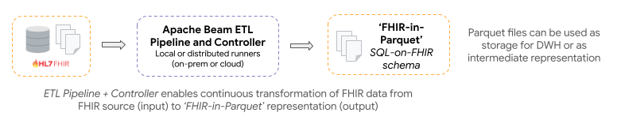

# OHS Analytics Concepts

The key concepts that underpin the OHS Analytics components are:

1. **ETL Pipelines:** ETL Pipelines and Controller can be configured to
   continuously transform FHIR data into an analytics friendly Parquet on FHIR
   format.
2. **Deployment approaches**: The pipelines are designed to accommodate various
   deployment approaches in terms of scalability; from a single machine to a
   distributed cluster environments.
3. **Query simplification approaches:** Once the data is transformed into an
   analytics-friendly format, it should be queried. Multiple approaches are
   provided and/or showcased to flatten FHIR schema to make developing analytics
   solutions easier.

## FHIR Data Pipes

FHIR Data Pipes is built on [Apache Beam](https://beam.apache.org/) SDK **for
ease of scalability** and has multiple deployment options from _local, to
on-prem clusters to public clouds_.

FHIR Data Pipes is made up of the **ETL Pipelines** and **Controller** modules *
*that are designed to work together** to provide continuous transformation of
FHIR data to Apache Parquet files (for data analysis) or another FHIR server (
for data integration).

## ETL Pipelines

Java binaries to **Extract**, **Transform** and **Load** FHIR data from a FHIR
source to Parquet format.

### Extraction

FHIR Data Pipes is designed to fetch FHIR source data in various forms and APIs:

* [FHIR Search API](https://www.hl7.org/fhir/search.html): This should work with
  most FHIR
  servers, including those using FHIR data model like HAPI FHIR or FHIR facades
  like OpenMRS.
* Direct database access: This is mostly a more efficient approach that works
  with HAPI FHIR only.
* Bulk Export API: This will gradually become our main fetch API as more FHIR
  servers implement
  the [Bulk Export API](https://build.fhir.org/ig/HL7/bulk-data/export.html).
* Files in json and ndjson formats.

### Transformation

FHIR Resources are transformed into a "Parquet on FHIR" format:

* Uses a forked version
  of [Bunsen library](https://github.com/google/fhir-data-pipes/tree/master/bunsen) (
  currently supports STU3 and R4 versions of FHIR)
* Configurable support for FHIR profiles and extensions
* (Optional) In-pipeline 'flattening' of FHIR data
  using [ViewDefinition](https://build.fhir.org/ig/FHIR/sql-on-fhir-v2/StructureDefinition-ViewDefinition.html)
  resources - [read more](../views#viewdefinition-resource)

### Loading

FHIR Data Pipes supports different SQL Data Warehouse options depending on the
needs of the project. These include:

* Loading Parquet files into an OLAP query engine such as SparkSQL (which can be
  deployed on a single machine or a distributed cluster) or DuckDB (single
  machine in-process) or many other tools that understand Parquet.
* Traditional relational databases such as PostgreSQL (when using
  FHIR [ViewDefinition](https://build.fhir.org/ig/FHIR/sql-on-fhir-v2/StructureDefinition-ViewDefinition.html)
  resources to generate materialized views)

## Pipeline Controller Module

A user-interface wrapper for the FHIR Data Pipes Pipelines, integrating "
full", "incremental", and "merger" pipelines together.

* The Pipelines Controller is built on top of pipelines and shares many of the
  same settings
* Using the controller module you can schedule periodic incremental updates or
  use the [Web Control Panel](../../additional/#web-control-panel) to start the
  pipeline
  manually

## Deployment Approaches

There are a number of different deployment approaches - see table below.

Choosing the right approach, comes down to a number of factors including the
specific use-case, infrastructure constraints of the project, future scalability
requirements, and expertise of the team.

| Scenario                                                                         | Approach                                                                                                        | Considerations                                                                            |
|----------------------------------------------------------------------------------|-----------------------------------------------------------------------------------------------------------------|-------------------------------------------------------------------------------------------|
| Simple relational database to power dashboards or reporting                      | Custom schema defined as ViewDefinition Resources - [see Views](../views/#query-simplification)                 | By design, this will provide a subset of FHIR data in flat tables                         |
| Horizontally scalable query architecture with lossless FHIR data                 | Parquet based DWH and distributed query engine (e.g. SparkSQL) - [see tutorial](../../tutorials/add_dashboard/) | This requires a distributed file system for Parquet files and a distributed query engine. |
| Lossless FHIR DWH with a single process query engine                             | Parquet based DWH with non-distributed query engine set-up (e.g. single-node Spark or DuckDB)                   | Scalability and performance (e.g. SparkSQL >> DuckDB)                                     |
| Exploratory data science or ML use cases                                         | Use the generated Parquet files which as _"near lossless"_ for enhanced data science workflows                  | Can either use the Parquet or custom schema to power dashboards or reports                |
| Push FHIR data to a central FHIR-store (e.g., for a Shared Health Record system) | Use the Pipelines Controller to push from a FHIR source to a FHIR sink                                          | Management of the intermediate Parquet files created as part of the pipelines             | 

## Query Simplification with Flat Views

FHIR Data Pipes provides two approaches for flattening the FHIR resources into
virtual or materialized views:

1. SQL queries to generate virtual views (outside the pipeline)

2. FHIR [ViewDefinition](https://build.fhir.org/ig/FHIR/sql-on-fhir-v2/StructureDefinition-ViewDefinition.html)
resources to generate materialized views (within the pipeline)

For more information on both of these approaches, please
check [Schema and Flat Views](views.md).

