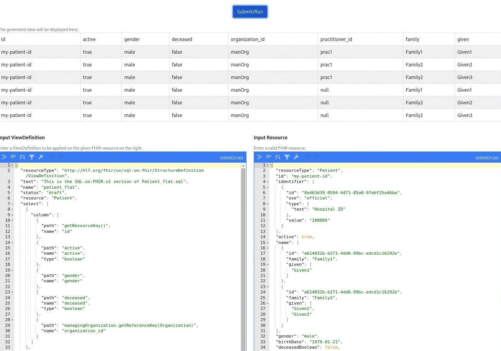

# Schema and Flat Views

## Overview

The heavily nested nature of FHIR resources and the
_[Parquet-on-FHIR schema](#parquet-on-fhir-schema)_ requires complex SQL queries
that can make them difficult to work with for analytics use cases. A common
approach to address this is to flatten the data into a set of views (virtual or
materialized) which can then be queried using simpler SQL statements.

## Parquet-on-FHIR schema

The _FHIR Data Pipes ETL Pipelines_ convert raw FHIR resources to a
_Parquet-on-FHIR_ schema representation. This takes place for each resource type
and follows the
[Schema Mapping Rules](https://github.com/google/fhir-data-pipes/blob/master/doc/schema.md).

The generated columnar Parquet files provide the _"base data warehouse"_ that
can be queried using any Parquet-aware tools (e.g a SQL based query engine) or
further transformed [via the view layer](#flattening-via-the-view-layer) into
materialized views.

## Flattening via the view layer

FHIR Data Pipes provides two approaches for flattening the FHIR resources into
virtual or materialized views:

1. SQL queries to generate
   [virtual views](https://github.com/google/fhir-data-pipes/tree/master/docker/config/views)
   ( outside the pipeline)

2. FHIR
   [ViewDefinition](https://build.fhir.org/ig/FHIR/sql-on-fhir-v2/StructureDefinition-ViewDefinition.html)
   resources to generate materialized views (within the pipeline)

For both of these approaches, a set of
[**"predefined views"**](https://github.com/google/fhir-data-pipes/tree/master/docker/config/views)
for common FHIR resources are provided. These can be modified or extended.

The currently supported list (as of July, 2024) are:

```
Condition
DiagnosticReport
Encounter
Immunization
Location
Medicationrequest
Observation
Organization
Patient
Practitioner
PractitionerRole
Procedure
```

### SQL virtual views

These are samples of more complex SQL-on-FHIR queries for defining flat views
for common FHIR resources. These virtual views are applied outside the pipelines
in a downstream SQL query engine.

The queries, which have `.sql` suffix, can be found in
[/docker/config/views](https://github.com/google/fhir-data-pipes/tree/master/docker/config/views)
directory (e.g `Patient_flat.sql`).

An example of a flat view for the Observation resource is below:

```sql
CREATE OR REPLACE VIEW flat_observation AS
SELECT O.id AS obs_id, O.subject.PatientId AS patient_id,
        OCC.`system` AS code_sys, OCC.code,
        O.value.quantity.value AS val_quantity,
        OVCC.code AS val_code, OVCC.`system` AS val_sys,
        O.effective.dateTime AS obs_date
      FROM Observation AS O LATERAL VIEW OUTER explode(code.coding) AS OCC
        LATERAL VIEW OUTER explode(O.value.codeableConcept.coding) AS OVCC
```

## Query Simplification

The following example is taken from a tutorial Jupyter notebook available
[here](https://github.com/google/fhir-data-pipes/blob/master/query/queries_large.ipynb).

The following queries count the number of patients that have had an observation
with a specific code (HIV viral load), with a value below a certain threshold
for the year 2010.

=== "Standalone Query"

    ```sql
    SELECT COUNT(DISTINCT O.subject.PatientId) AS num_patients
      FROM Observation AS O LATERAL VIEW explode(code.coding) AS OCC
      WHERE OCC.code LIKE '856%%'
        AND OCC.`system` = 'http://loinc.org'
        AND O.value.quantity.value < 400000
        AND YEAR(O.effective.dateTime) = 2010;
    ```
    The output relation should have a count of 3074 patients:
    ```
    +---------------+
    | num_patients  |
    +---------------+
    | 3074          |
    +---------------+
    ```

=== "Query with Views"

    ```sql
    SELECT COUNT(DISTINCT patient_id) AS num_patients
      FROM Observation_flat
      WHERE code LIKE '856%%'
        AND code_sys = 'http://loinc.org'
        AND val_quantity < 400000
        AND YEAR(obs_date) = 2010
      LIMIT 100;
    ```
    The output relation should have a count of 3074 patients:
    ```
    +---------------+
    | num_patients  |
    +---------------+
    | 3074          |
    +---------------+
    ```

This approach preserves the nested structures and arrays of FHIR resources
within the `Observation_flat` view. The results of these queries can then be
used as arbitrary tables for further data analysis in other tools.

### ViewDefinition resource

The
[SQL-on-FHIR-v2 specification](https://build.fhir.org/ig/FHIR/sql-on-fhir-v2/)
defines a ViewDefinition resource for defining views. Each column in the view is
defined using a [FHIRPath expression](https://hl7.org/fhirpath/). There is also
an un-nesting construct and support for `constant` and `where` clauses too.

!!! info "Note"

    * A singlular View Definition will not join different resources in any way
    * Each View Definition defines a tabular view of exactly one resource type

A system (pipeline or library) that implements the “View Layer” of the
specification provides a View Runner that is able to process these FHIR
ViewDefinition Resources over the “Data Layer” (lossless representation of the
FHIR data). The output of this are a set of portable, tabular views that can be
consumed by the “Analytics Layer” which is any number of tools that can be used
to work with the resulting tabular data.

FHIR Data Pipes is a
[reference implementation](https://fhir.github.io/sql-on-fhir-v2/#impls) of the
SQL-on-FHIR-v2 specification:

- The "View Runner" is, by default, part of the ETL Pipelines and uses the
  transformed Parquet files as the “Data Layer”. _This can be extracted to be a
  stand-alone component if required_

- When enabled as part of the Pipeline configuration, thr "View Runner" will
  apply the ViewDefinition resources from the
  [views folder](https://github.com/google/fhir-data-pipes/tree/master/docker/config/views)
  and materialize the resulting tables to the configured database (an instance
  of PostgresSQL, MySQL, etc.).

- A set of pre-defined ViewDefinitions for common FHIR resources is provided as
  part of the default package. These can be adapted, replaced and extended.

- The FHIR Data Pipes provides a simple ViewDefinition Editor which can be used
  to explore FHIR ViewDefinitions and apply these to individual FHIR resources.

Once the FHIR data has been transformed via the ETL Pipelines, the resulting
schema is available for querying using a JDBC interface.

Visit our [interactive playground](https://fhir.github.io/sql-on-fhir-v2/#pg) to
get a hands-on understanding of the Patient ViewDefinition resource, and many
more

### ViewDefinition editor

The ViewDefinition editor provides a way to quickly evaluate ViewDefinition
resources against sample FHIR data. You access it as part of the
[Web Control Panel](../additional#web-control-panel), selecting the "Views"
navigation item in the top right corner.

Using the ViewDefinition editor you can:

- Provide an input ViewDefinition (left)
- Apply it to a sample input FHIR resource (right pane)
- View the results in the generated table (top)



## Output Data Formats

Applying the FHIR ViewDefinition resources to the "base dwh" will generate
materialized views which represent a "constrained" set of data to be used for
downstream analytics applications (such as dashboards or reporting). This
feature is enabled when the
[viewDefinitionsDir](https://github.com/google/fhir-data-pipes/blob/ffecd7c7bf23d86bee0c6dde0dd5d549038f769d/pipelines/controller/config/application.yaml#L166C3-L166C21)
is set.

These can be outputted in any tabular format with current support for Database
tables and Parquet files.

### Conversion to Database tables

The resulting database tables can be loaded into a commonly used relational
database management system such as [PostgresSQL](https://www.postgresql.org/) or
[MySQL](https://www.mysql.com/). This is enabled when the
[sinkDbConfigPath](https://github.com/google/fhir-data-pipes/blob/ffecd7c7bf23d86bee0c6dde0dd5d549038f769d/pipelines/controller/config/application.yaml#L173)
is set.

### Conversion to Parquet

The resulting Parquet files can be easily loaded into any Parquet-aware query
engine. Examples include [SparkSQL](https://spark.apache.org/sql/) or
[duckdb](https://duckdb.org/)
