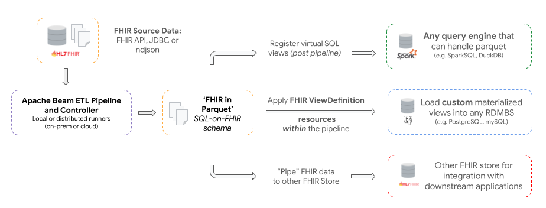

# Introduction
The Open Health Stack's Analytics components provide a scalable and flexible collection of tools to transform complex [HL7 FHIR](https://www.hl7.org/fhir/overview.html) data into formats for running _analytics_ workloads and building downstream applications. 

Using OHS, developers can use familiar languages and tools to build analytics solutions for different use cases: from generating reports and powering dashboards to exploratory data science and machine learning.

## Key features

*	[Apache Beam](https://beam.apache.org) based ETL pipeline to transform FHIR resources to _"near lossless"_ 'FHIR-in-Parquet' representation based on the ["Simplified SQL Projection of FHIR Resources"](https://github.com/FHIR/sql-on-fhir/blob/master/sql-on-fhir.md) schema

*   Pipelines Controller module provides pipeline management and scheduling capabilities.

*   Flexible deployment modes to meet the needs of different projects and teams from simple single machine to multi-worker horizontally scalable distributed environments. With support for local, on-prem or cloud based runners

* 	Seamless support for different target databases including traditional RDBMS (such as [PostgreSQL](https://www.postgresql.org/)) or OLAP Database Engines that can load Parquet files (such as [SparkSQL](https://spark.apache.org/sql/) or [DuckDB](https://duckdb.org/)) 

*	Simplify querying data by defining views in SQL or as [ViewDefinition](https://build.fhir.org/ig/FHIR/sql-on-fhir-v2/StructureDefinition-ViewDefinition.html) resources to create flattened tables. Easily build analytics applications with common languages (e.g. SQL, python) and BI or data visualizations tools (e.g. [Apache Superset](https://superset.apache.org/))

## Use cases

*   The **primary use case** for FHIR Data Pipes is to enable continuous transformation of FHIR Data into analytics friendly representations to make it easier for developers to: build dashboards, generate reports, do data science and machine learning

*   A **secondary use case** is for piping FHIR data from a FHIR sources to another FHIR server e.g. for integration into a central FHIR repository