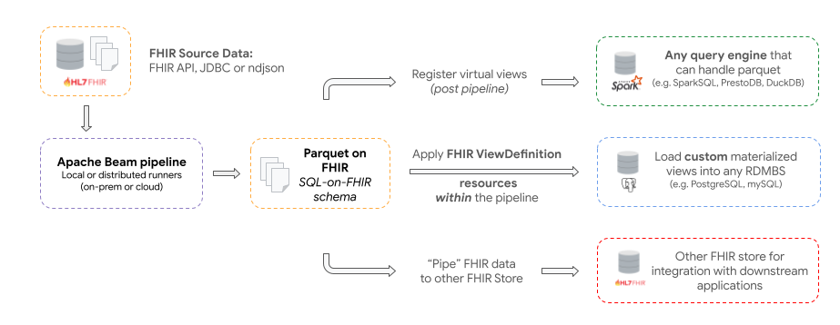

# Introduction

The Open Health Stack's FHIR Analytics components provide a scalable and flexible collection of tools to transform complex [HL7 FHIR](https://www.hl7.org/fhir/overview.html) data into formats for running _analytics_ workloads and building downstream applications. 

Using OHS, developers can use familiar languages, packages and tools to build analytics solutions for different use cases: from generating reports and powering dashboards to exploratory data science and machine learning.

## Key features

*	Transform FHIR resources to (near) _"lossless"_ Parquet on FHIR representation based on the ["Simplified SQL Projection of FHIR Resources"](https://github.com/FHIR/sql-on-fhir/blob/master/sql-on-fhir.md) schema

* 	**Horizontally scalable** Apache Beam based ETL pipeline to continuously transform FHIR data for use in downstream applications. Support for local, on-prem or cloud runners and deployment options

* 	Seamless support for different Data Warehouses from traditional RDBMS (such as [PostgreSQL](https://www.postgresql.org/)), OLAP Database Engines (such as [DuckDB](https://duckdb.org/)) to **Distributed query engines** (such as [SparkSQL](https://spark.apache.org/sql/), [Trino](https://trino.io/) or [PrestoDB](https://prestodb.io/))

*	Define views in SQL or as [ViewDefinition](https://build.fhir.org/ig/FHIR/sql-on-fhir-v2/StructureDefinition-ViewDefinition.html) resources to create flattened tables to make it easier to query data using common languages like SQL or python

## Use cases

*   The **primary use case** for FHIR Data Pipes is to enable continuous transformation of FHIR Data into analytics friendly representations.

*   A **secondary use case** is for piping FHIR data from a FHIR sources to another FHIR server e.g. for integration into a central FHIR repository

## Deployment Approaches

There are a number of different deployment approaches - see table below. 

Choosing the right approach, comes down to evaluation of a number of factors including the specific use case, requirements of the project, future scalability needs and capabilities of the team. 

| Approach | Scenarios | Considerations |
| -------- | ----------| -------------- |
| RDBMS using "lossy" schema (defined as ViewDefinition Resources) | Using a relational database to power dashboards or reporting | By design this will provide a constrained set of variables in the views |
| Distributed "lossless" parquet based DWH and distributed query engine | Need for a horizontally scalable architecture | Will need to manage both distributed storage (Parquet) and a distributed query engine |
| Non-distributed "lossless" parquet based DWH | Want to leverage parquet with a non-distributed OLAP database engine (such as duckdb) | Scalability |
| FHIR to FHIR Pipe | Push FHIR data to a central FHIR Data Store to be used as a Shared Health Record or as single repository for analytics workloads | Management of the intermediate Parquet files created as part of the pipelines | 