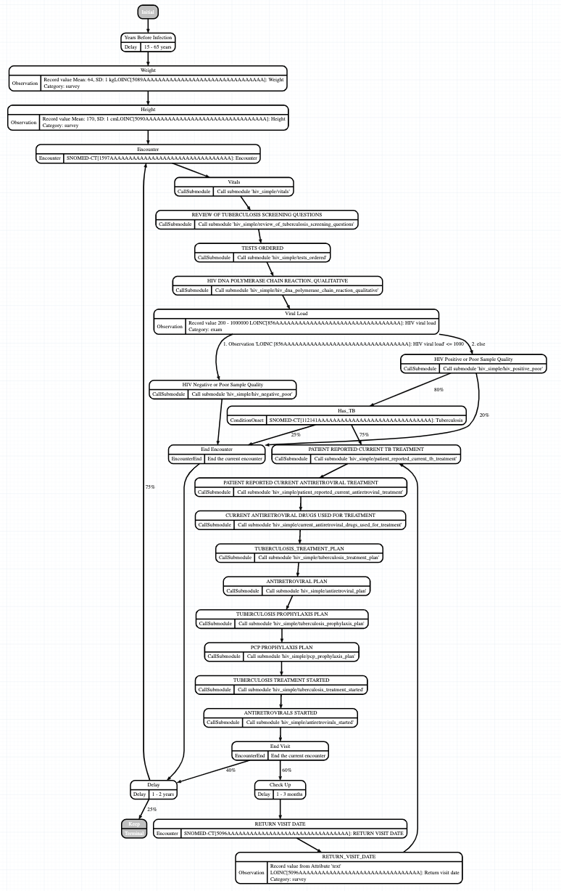

# Synthea-HIV

This is an experimental module for generating OpenMRS patients with HIV using
the [Synthea](https://github.com/synthetichealth/synthea) fake data generator,
and then uploading the transaction Bundles to a FHIR Server.

## Generator

The [`generator`](generator) folder has the model for generating patients, as
well as the Dockerfile used to build the
`us-docker.pkg.dev/cloud-build-fhir/fhir-analytics/synthea-generator:latest`
image.

To generate data, run the following command in your terminal (Docker is needed):

```bash
docker run  -it   -v "$(pwd)"/output:/synthea-hiv/output \
  -e POPULATION=100 \
  us-docker.pkg.dev/cloud-build-fhir/fhir-analytics/synthea-generator:latest
```

Setting `POPULATION` to the number of patients you want to generate.

The [`sample_data`](sample_data) folder contains sample data from running
the generator.

## Uploader

To upload to  a GCP FHIR Store, run the following commands in your terminal
(Python3 is needed):

```bash
PROJECT_ID=my-project-id
LOCATION=location-of-dataset
DATASET=dataset-name
FHIR_STORE=fhir-store-name
FHIR_ENDPOINT=https://healthcare.googleapis.com/v1beta1/projects/$PROJECT_ID/locations/$LOCATION/datasets/$DATASET/fhirStores/$FHIR_STORE/fhir

gcloud auth application-default login
cd ./uploader
python3 main.py GCP $FHIR_ENDPOINT \
  --input_dir /absolute/path/to/fhir/bundles
```

To upload to a HAPI Server, run the following:

```bash
FHIR_ENDPOINT=http://localhost:8091/fhir
cd ./uploader
python3 main.py HAPI $FHIR_ENDPOINT \
  --input_dir /absolute/path/to/fhir/bundles
```

To upload to an OpenMRS Server, run the following:

```bash
FHIR_ENDPOINT=http://localhost:8099/openmrs/ws/fhir2/R4
cd ./uploader
python3 main.py OpenMRS $FHIR_ENDPOINT \
  --input_dir /absolute/path/to/fhir/bundles
  --convert_to_openmrs
```

When uploading to an OpenMRS Server, you _must_ specify the
`--convert_to_openmrs` flag. This flag is optional when uploading to GCP FHIR
Store or HAPI.

If you prefer using Docker, you can do the following:

```bash
gcloud auth application-default login
cd ./uploader
docker build -t synthea-uploader .
docker run -it --network=host \
  -e SINK_TYPE="GCP" \
  -e FHIR_ENDPOINT=$FHIR_ENDPOINT \
  -e CONVERT="--convert_to_openmrs" \
  -v ~/.config/:/root/.config \
  -v /absolute/path/to/fhir/bundles:/workspace/output/fhir \
  synthea-uploader
```

The `CONVERT` variable is optional, but if you want to upload to an OpenMRS
server, you _must_ add it and set its value to `--convert_to_openmrs` flag. See
the [Limitations](#Limitations) section below as to why.

## Model

The model is based on the
[list](https://github.com/GoogleCloudPlatform/openmrs-fhir-analytics/issues/179#issuecomment-895040775)
of essential codes (Q&A) that are frequently used by AMPATH.



The main module contains calls to submodules. Each submodule is a question used
by AMPATH, with a distribution of answers that can be chosen. Below is an
example of how a Submodule looks:


## Limitations

* Synthea only accepts [LOINC](https://loinc.org/) and
  [SNOMED-CT](https://www.snomed.org/) as codes and value codes. OpenMRS works
  with [CIEL](https://research.columbia.edu/covid/mapping/COVIDdictionary)
  codes. To get around this, even though the JSON files in the
  [`generator`](generator) folder refer to LOINC or SNOMED-CT as the code, the
  coded value of each question and answer is actually from CIEL. This is
  regardless of whether the flag `convert_to_openmrs` is specified or not when
  uploading.

* Due to [this](https://github.com/moby/moby/issues/2259) issue in Docker, the
  outputted directories and files generated will be owned by `root`, not your
  user. When deleting the directories/files without `sudo` or admin privileges,
  you will get permission denied.

* The OpenMRS FHIR Module does not yet support uploading Bundles. To circumvent
  this, the uploader splits each Bundle into the individual Patient, Encounters,
  and Observations resources before uploading.

* Running the uploader more than once will lead to duplicates in the GCP FHIR
  Store. All requests are sent as POST, which means a server-generated ID will
  be used to identify the patient. If the same patient bundle is uploaded, a new
  ID will be generated each time. OpenMRS does not have this limitation as each
  Patient requires an OpenMRS ID. This ID does not change if there's an attempt
  to upload the patient multiple times. OpenMRS will through an error if a user
  attempts to upload a bundle more than once.
